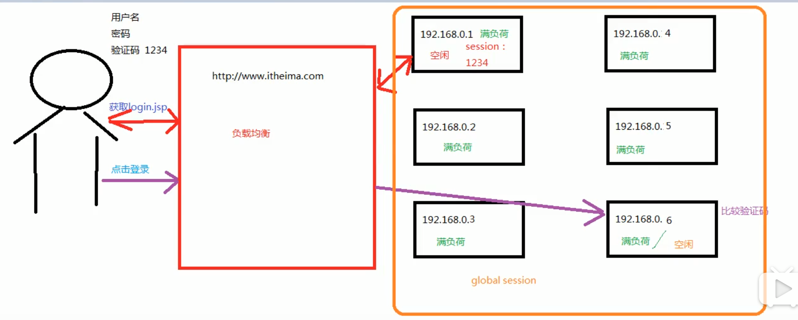

###一、spring配置文件的三种创建bean的方式
1.直接用id和class
2.牵扯普通工厂：先创建工厂的bean，再创建工厂生产的对象的bean（factory-bean和factory-method）
3.牵扯工厂的静态方法：直接用id(工厂生产的对象)和class（工厂的全限定类名）加上factory-method（制造对象的方法）
###二、bean的作用范围调整( bean标签的scope属性，作用：用来制定bean的作用范围）
                       

###三、bean对象的生命周期
```xml
bean对象的生命周期
            单例对象：
                出生：当容器创建时
                活者：容器只要还在，就活着
                死亡：容器销毁，对象消亡
                总结：单例对象的生命周期和容器相同
            多例对象：
                出生：当我们使用对象（getbean（）方法）时spring为我们创建
                活着：对象只要是再使用过程中就一直活着。
                死亡：当对象长时间不用，且没有别的对象引用的时候，由GC处理

```