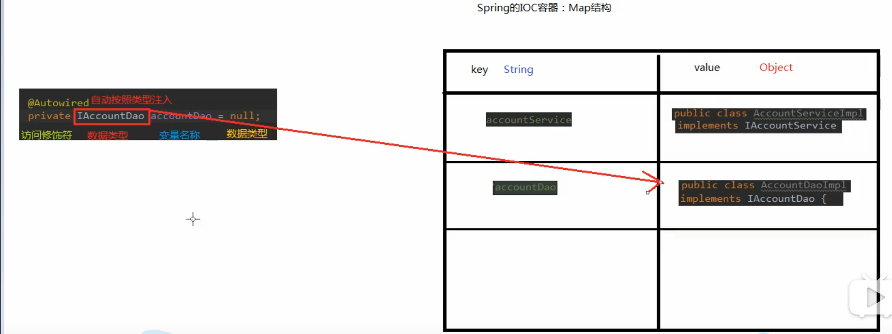
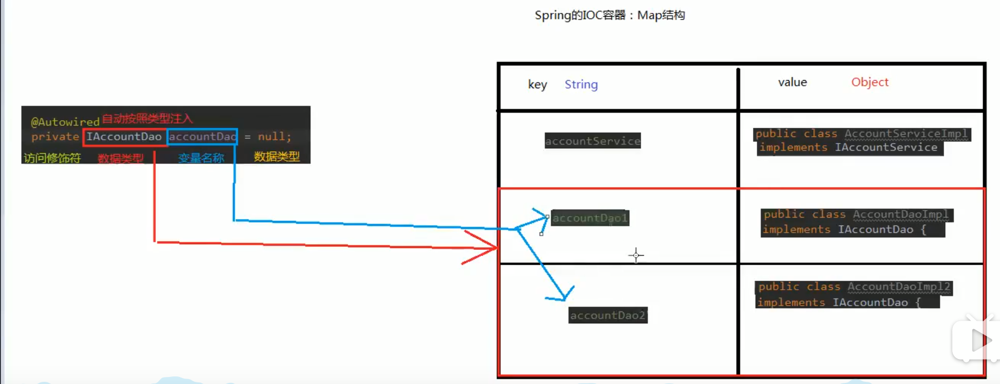

#通过注解注入
##一、使用注解前准备
###1.需要spring-aop.jar

###2.给配置文件导入context命名空间和约束，并使用<component-scan>标签扫描标签
##二、使用标签
###3.用于创建对象
@Component

@Controller

@Service

@Repository
###4.用于注入数据
@Autowired

@Qualifier

**@Resource(name=""")**

**@Value**
###5.用于改变作用范围的
@Scope

###6.和生命周期相关
@PostConstruct

@PreDestroy
