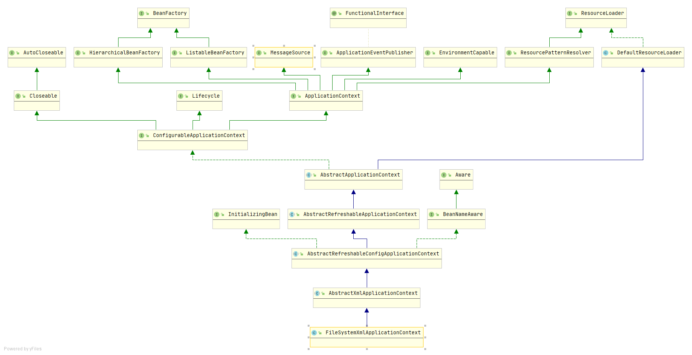

## FileSystemXmlApplicationContext分析

首先看继承关系图：

看一看ApplicationContext和FileSystemXmlApplicationContext的关系，其实，ApplicationContext的主要功能已经在AbstractXmlApplicationContext中实现了，FileSystemXmlApplicationContext只需要干点自己相关的事情就对啦（它用来读取绝对路径的BeanDefinition，所以需要干这件事），具体来说，就是refresh IoC容器和读取Xml形式的BeanDefinition这两件事。

