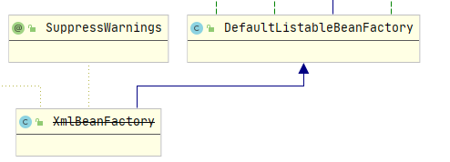

**首先，XmlBeanFactory已经弃用了，但是了解其源码能更好的理解Spring**

一、XmlBeanFactory继承自DefaultListableBeanFactory,DefaultListableBeanFactory是一个功能完整的IoC容器




IoC要干的事就是吧配置文件中的Bean（称作BeanDefinition）读取并存进IoC容器中，看看源码：
```java
public class XmlBeanFactory extends DefaultListableBeanFactory {

	private final XmlBeanDefinitionReader reader = new XmlBeanDefinitionReader(this);
	
	public XmlBeanFactory(Resource resource) throws BeansException {
		this(resource, null);
	}

	
	public XmlBeanFactory(Resource resource, BeanFactory parentBeanFactory) throws BeansException {
		super(parentBeanFactory);
		this.reader.loadBeanDefinitions(resource);
	}

```

在spring中BeanDefinition都是从配置文件里读来封装在Resource中，比如可以通过
```java
Resource resource = new ClassPathResource("bean.xml");
```
来将配置文件中的BeanDefinition封装到Resource对象中


然后其实XmlBeanFactory内部是使用XmlBeanDefinitionReader.loadBeanDefinitions(resource)来读取BeanDefinition的

画个图如下：

